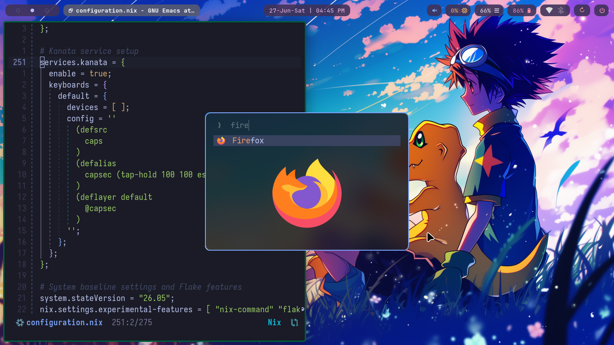
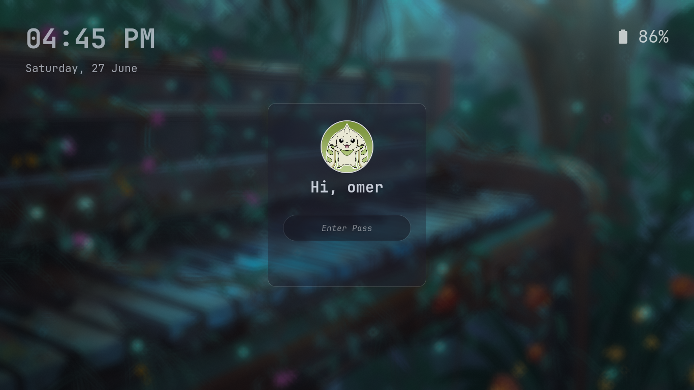

# Dotfiles

My personal, declarative NixOS configs with **Flakes + Home Manager.** Also structured for [GNU Stow](https://www.gnu.org/software/stow/). So these dotfiles work on any distro.

## 🛠️ Tech Stack & Workspace
* **Window Manager:** Niri WM (Scrollable-Tiling Wayland Compositor)
* **Bar:** Waybar (Configured with custom modules)
* **Notification Daemon:** Mako (custom styling)
* **User Shell:** Zsh + Oh My Zsh (With syntax highlighting & autocomplete)
* **File Manager:** Thunar (GTK environment optimized)
* **Text Editors:** Emacs / Nvim (fully configured)
* **Sync Core:** Syncthing (User daemon layer active)
* **Application launcher** Fuzzel (custom styling)
* **Browser** Betterfox (Firefox enhacned user.js)


## 🎨 Interface Aesthetics
* **UI Font:** Inter (Anti-aliased & subpixel optimized)
* **Code Font:** Iosevka / JetBrains Mono Nerd Font
* **Icons:** Papirus-Dark Icons
* **Cursor:** Bibata Modern Classic Cursors
* **Theme:** Arc-Dark GTK3/GTK4 Design


### Screenshots




## 🚀 Installation & Deployment

Clone the repo:

```
git clone https://github.com/Umer-Arif/dotfiles.git ~/dotfiles
```

### For NixOS Users

Home Manager will read the repository and symlink everything automatically:


```bash
cd ~/dotfiles
git add .
sudo nixos-rebuild switch --flake .#omer
```


### For Other Distros

1. Install GNU Stow:
``` shell
#Arch
sudo pacman -S stow

#Fedora
sudo dnf install stow
```


2. Enter the directory:

```
cd ~/dotfiles
```

3. Use GNU Stow to symlink the configs you want:

```
stow niri
stow waybar
stow emacs
stow ghostty
stow fuzzel
# etc...

```

This will create symlinks in `~/.config/...` pointing to the files here.

### 📂 Structure

Each directory here corresponds to one program. For example:

`niri/` → `~/.config/niri/`

`mpv/` → `~/.config/mpv/`

`nvim/` → `~/.config/nvim/`

## ⚠️ Important Configuration Notes

* **Text Editors**: 
**Emacs** ; Full-time editor for development, org-mode, and everything else. 
**Neovim** — Kept around for quick edits (config files, small scripts), but config is bit old. It works, but you might need to debug or update plugins if you use it.

* **No Display Manager:** This setup **does not use a display manager** (like SDDM, Greetd, or LightDM) as it's faster and simpler wihotut it. The system boots directly into a clean text console (TTY) prompt. To launch the graphical desktop interface from the terminal, simply log in and run:

  ```bash
  niri-session
  ```
